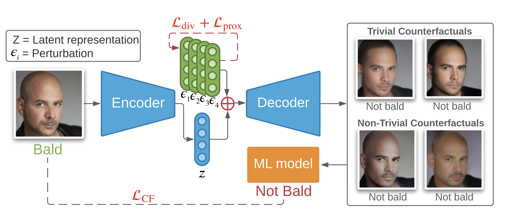

# Beyond Trivial Counterfactual Explanations with Diverse Valuable Explanations 
**Pretrained models arriving soon**

## Accepted at ICCV2021 [[Paper]](https://arxiv.org/abs/2103.10226)

<p align="center" width="100%">

</p>

### 0. Download the Dataset
* [Images](https://drive.google.com/file/d/0B7EVK8r0v71pZjFTYXZWM3FlRnM/view?usp=sharing&resourcekey=0-dYn9z10tMJOBAkviAcfdyQ)
* [Labels](https://drive.google.com/file/d/0B7EVK8r0v71pblRyaVFSWGxPY0U/view?usp=sharing&resourcekey=0-YW2qIuRcWHy_1C2VaRGL3Q)
* Uncompress them into a path of your choice. Assuming that `$DATA` corresponds to the path where celebA has been placed, move `./data/celeba_meta` into `$DATA`. 

### 1. Install requirements

`pip install -r requirements.txt` 

### 2. Reproduce Results
To run an experiment you will need to call:

```python
python trainval.py -e tcvae -sb ./logs -d ./data -r 1
```

Where the argument descriptions are:

```
-e  [Experiment group to run like 'vae' (the rest of the experiment groups are in exp_configs/main_exps.py)] 
-sb [Directory where the experiments are saved]
-r  [Flag for whether to reset the experiments]
-d  [Directory where the datasets are aved]
```

To reproduce the results you will need to run:

```python
python trainval.py -e tcvae -sb ./logs/tcvae -d ./data -r 1
python trainval.py -e vae -sb ./logs/vae -d ./data -r 1
python trainval.py -e oracle -sb ./logs/oracle -d ./data -r 1
python trainval.py -e unbiased_classifier -sb ./logs/classifier -d ./data -r 1
```

This will train all the generators and classifiers needed to reproduce the experiments. Then, assuming you only ran one hyperparameter combination per model (so there is only one folder inside `./logs/tcvae/`, etc, run:

```bash
mv ./logs/tcvae/* ./data/pretrained_models/tcvae
mv ./logs/vae/* ./data/pretrained_models/xgem+
mv ./logs/oracle/* ./data/pretrained_models/oracle
mv ./logs/unbiased_classifier/* ./data/pretrained_models/unbiased_classifier
```

Finally, run the BTE experiment:

```python
python trainval.py -e cache_fim -sb ./logs/bte -d ./data -r 1
python trainval.py -e gradient_attacks -sb ./logs/bte -d ./data -r 1
```

You can plot the results by running the Jupyter notebook in `notebooks/Gather Results.ipynb`

### 3. Visualize Intermediate Results

Follow these steps to visualize plots. Open `results.ipynb`, run the first cell to get a dashboard like in the gif below, click on the "plots" tab, then click on "Display plots". Parameters of the plots can be adjusted in the dashboard for custom visualizations.

<p align="center" width="100%">

</p>

### 4. Beyond Trivial Explanatoins
Once 

## Cite
```
@article{rodriguez2021beyond,
  title={Beyond Trivial Counterfactual Explanations with Diverse Valuable Explanations},
  author={Rodriguez, Pau and Caccia, Massimo and Lacoste, Alexandre and Zamparo, Lee and Laradji, Issam and Charlin, Laurent and Vazquez, David},
  journal={arXiv preprint arXiv:2103.10226},
  year={2021}
}
```
